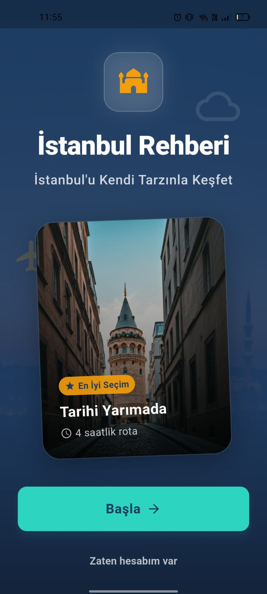
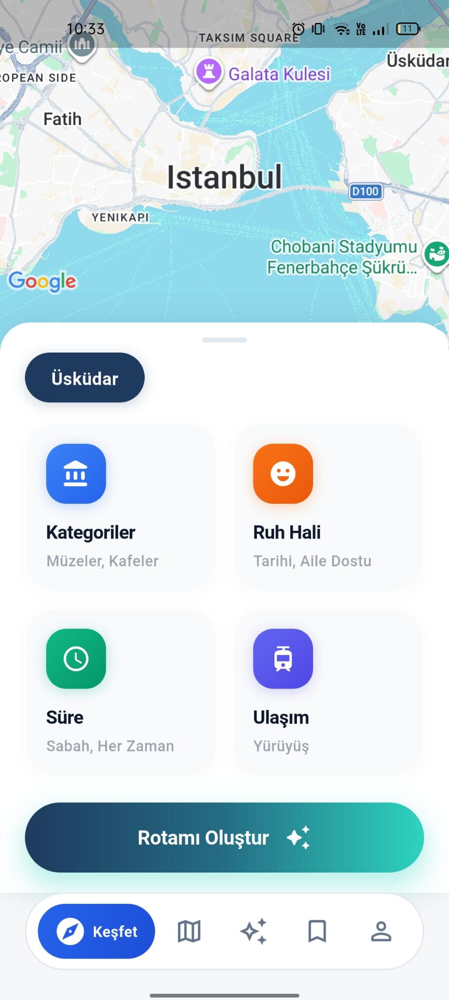
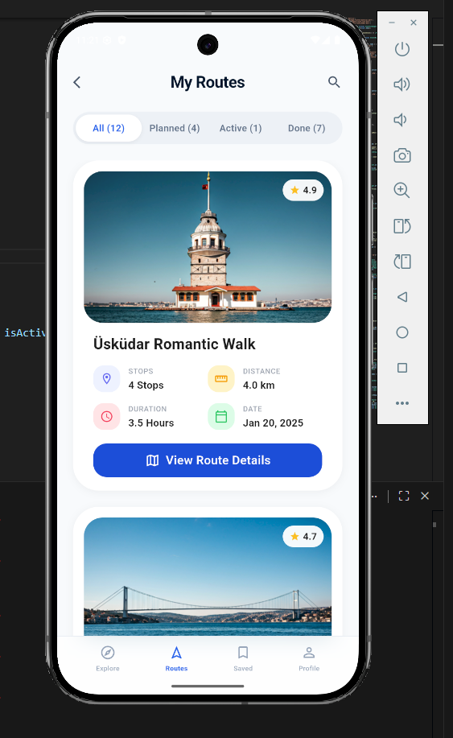

# GezAI

AI-powered travel route planning app for Istanbul.

## Screenshots

<p float="left">
  
  
  
  
  
</p>

## Project Structure

This is a **monorepo** containing both mobile app and backend:

```
GezAI/
├── app/                    # Flutter mobile application
├── backend/                # FastAPI backend (Cloud Run)
├── docs/                   # Documentation
├── firebase.json           # Firebase configuration
├── firestore.rules         # Firestore security rules
└── CLAUDE.md              # AI assistant guidance
```

## Quick Start

### Backend
```bash
cd backend
uv sync
uv run uvicorn app.main:app --reload
```

### Flutter App
```bash
cd app
flutter create . --org com.gezai --project-name gez_ai  # First time only
flutter pub get
flutter run
```

## Architecture

**Frontend (Flutter)**
- User authentication (Firebase Auth)
- Direct Firestore access for saved routes
- Calls backend API for places & route generation

**Backend (FastAPI)**
- Cache places from Google Places API
- Generate routes using Gemini LLM
- Generate Google Maps navigation links

**Firebase**
- Auth: User authentication (client-side)
- Firestore: Database for places, routes, saved routes

## Documentation

- [`CLAUDE.md`](./CLAUDE.md) - Development guide for AI assistants
- [`docs/PRD.md`](./docs/PRD.md) - Product requirements
- [`docs/TECHNICAL.md`](./docs/TECHNICAL.md) - API, architecture, Firestore schemas
- [`app/README.md`](./app/README.md) - Flutter app setup
- [`backend/README.md`](./backend/README.md) - Backend setup

## Tech Stack

- **Frontend**: Flutter, Riverpod, Firebase Auth, Firestore
- **Backend**: FastAPI, Firebase Admin SDK, Google Places API
- **AI**: Gemini 2.5 Flash Lite
- **Database**: Cloud Firestore
- **Deployment**: Cloud Run (backend), App Store/Play Store (app)
